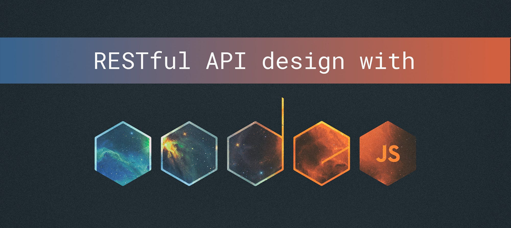

# NODEJS-API & MONGODB



Basic rest api with mongodb atlas.

## Routes
create: `http://localhost:5000/books/`. <br/>
getAll: `http://localhost:5000/books`. <br/>
getById: `http://localhost:5000/books/:_id`. <br/>
update: `http://localhost:5000/books/:_id`. <br/>
delete: `http://localhost:5000/books/:_id`. <br/>

## .env
```
DB_URI=yourUriHere
PORT=5000
```
